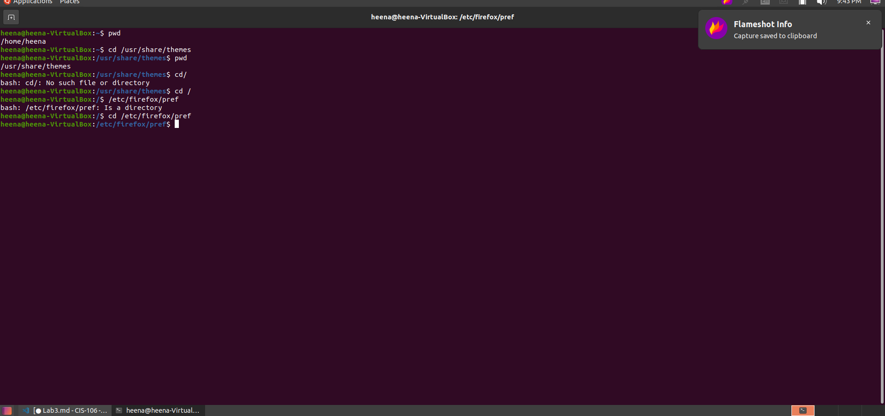
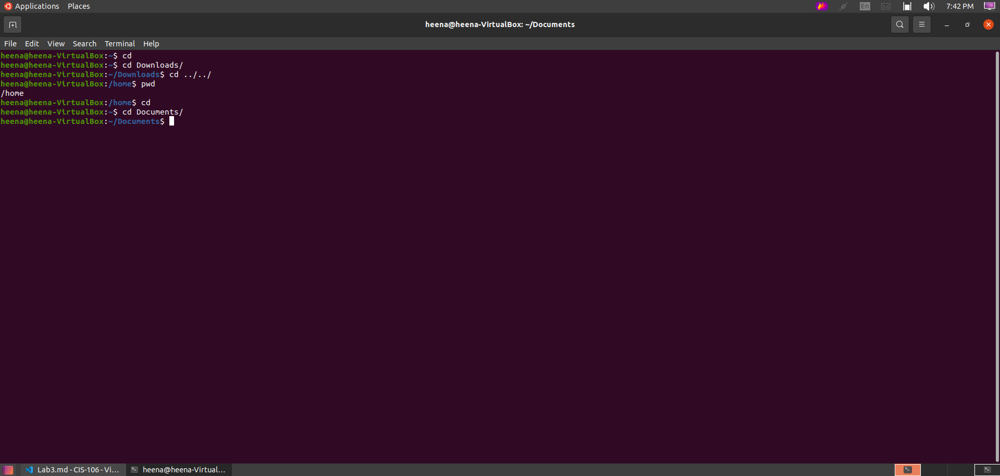
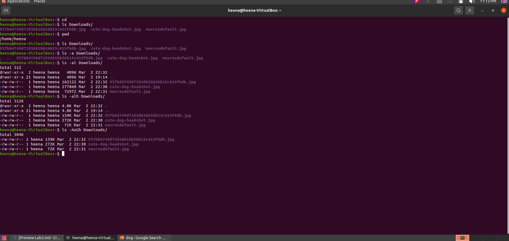
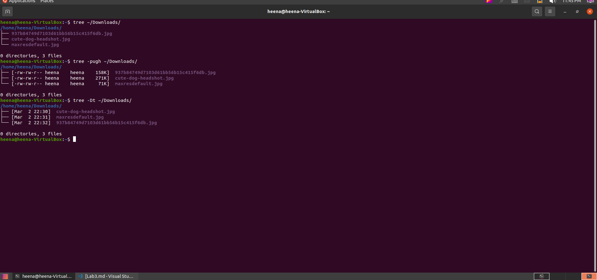
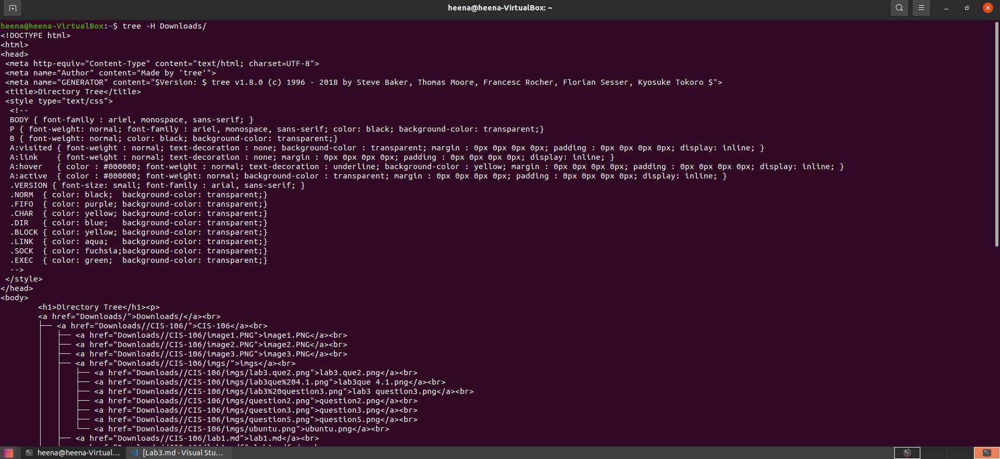
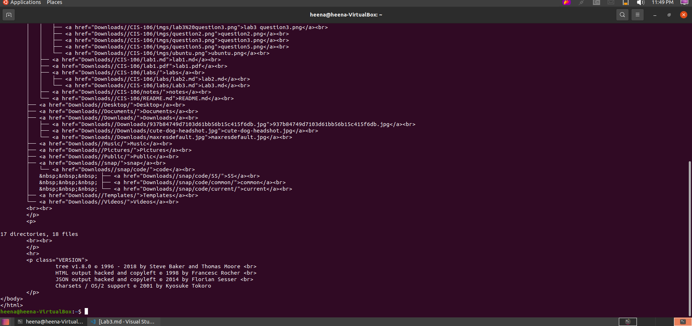
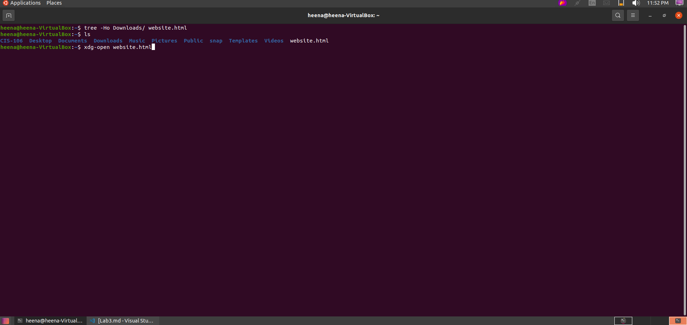
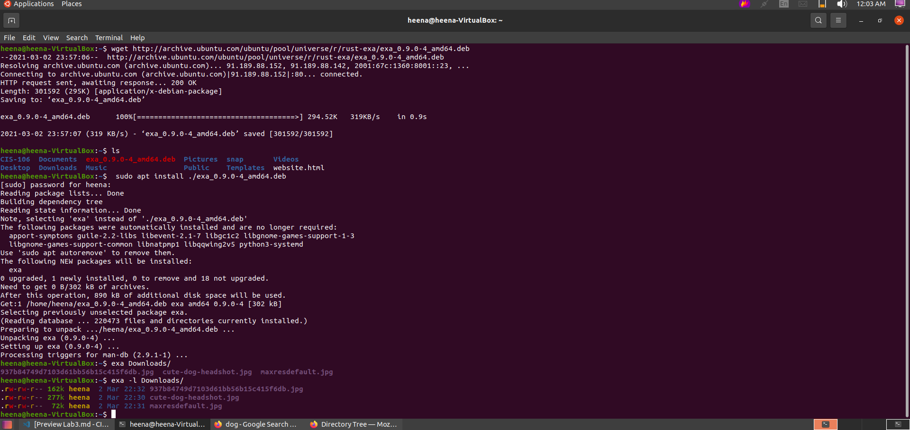
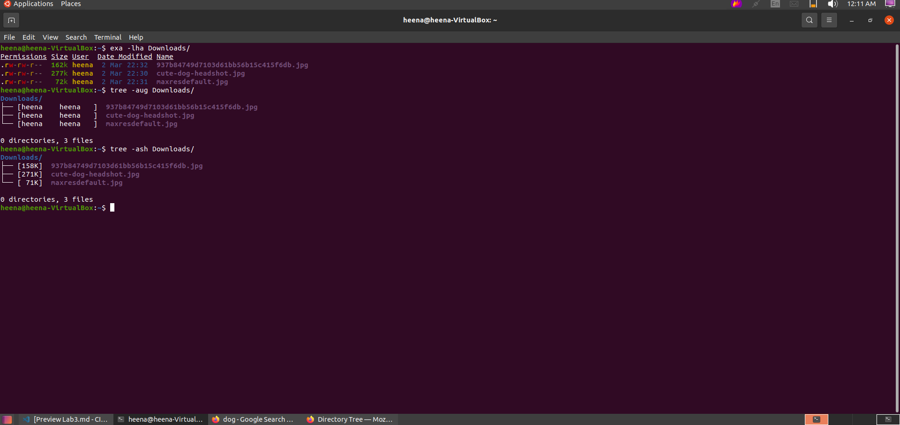

# Lab 3 | Installing software and navigating the file system | Answers
Assignment description [here](https://raw.githubusercontent.com/ra559/cis106/main/labs/lab3.md)

## Question 1
1. Which command did you use to search for the themes and to install them?
**sudo apt install theme and sudo apt yuyo gtk theme**

2. Which commands did you use to find and install the web browser?
**sudo apt search browser and install epiphany-browser**
3.1 What is the name of the package?
**focal,focal 1.4.1-2.1build4 all 3D racing game with ponies - game data**
3.2 What dependencies are needed in order to install the package? (you can either take a screenshot of the terminal or copy and paste from the terminal)
**apt- cache showpkg pink-pony-data**
3.3 How much disk space will the package utilize after installation?
**15.5 MB**
 

## Question 2
!

## Question 3

## Question 4

## Question 5

